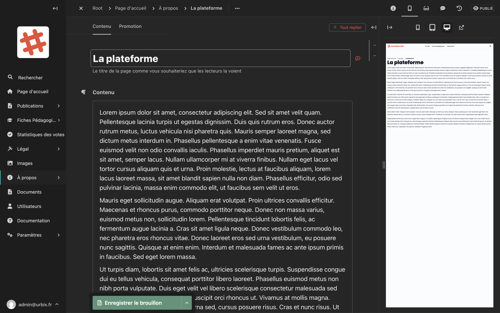

# Pages "À propos"

La section **À propos** contient les pages de présentation de la plateforme et de ses acteurs. Elle comprend trois pages :

- **La plateforme** : présentation générale du projet urbain
- **La commission d'urbanisme** : présentation de la commission
- **L'équipe de développement** : présentation de l'équipe technique

## Accéder aux pages "À propos"

Dans la barre latérale, cliquez sur **À propos** pour déployer le sous-menu, puis cliquez sur la page à modifier.

## Modifier une page

Chaque page de la section "À propos" a la même structure simple :

<!-- Capture d'écran : formulaire d'édition d'une page À propos avec le titre et le contenu -->

| Champ | Description |
|---|---|
| **Titre** | Le titre de la page tel qu'il apparaît sur le site |
| **Contenu** | Le texte principal de la page, avec l'éditeur de texte enrichi |

### Utiliser l'éditeur de texte

L'éditeur vous permet de mettre en forme votre texte :

- **Titres** : structurez votre contenu avec des titres de niveaux 2 et 3
- **Texte en gras** : pour mettre en évidence des informations importantes
- **Listes** : pour présenter des informations de manière claire
- **Liens** : pour renvoyer vers d'autres pages ou ressources

## Enregistrer et publier

Cliquez sur **"Enregistrer le brouillon"** pour sauvegarder, puis sur **"Publier"** pour mettre à jour la page en ligne.

> **Remarque :** Les modifications ne sont visibles par les visiteurs qu'après avoir cliqué sur **Publier**.
