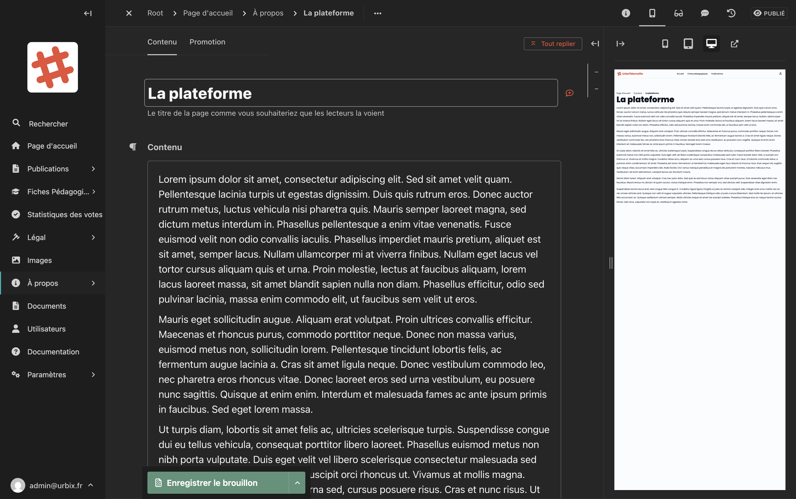

# Pages "À propos"

La section **À propos** contient les pages de présentation de la plateforme et de ses acteurs. Elle comprend trois pages :

- **La plateforme** : présentation générale du projet urbain
- **L'association** : présentation de l'association qui anime le site
- **L'équipe de développement** : présentation de l'équipe technique

## Accéder aux pages "À propos"

Dans la barre latérale, ouvrez **Pages du site**, puis cliquez sur la page à modifier : *La plateforme*, *L'association* ou *L'équipe de développement*.

## Modifier une page

Chaque page de la section "À propos" se compose de **blocs**, comme la [page d'accueil](page-accueil.md) :

<!-- Capture d'écran : formulaire d'édition d'une page À propos avec le titre et le contenu -->

| Champ | Description |
|---|---|
| **Titre** | Le titre de la page tel qu'il apparaît sur le site |
| **Contenu** | Les blocs de la page : texte, sections, chiffres clés, citations, questions, invitation à s'inscrire… |
| **Membres** | *Commission et équipe de développement* : les personnes présentées, affichées après le contenu |

Le bloc **Texte** garde la largeur de lecture et permet les titres de niveaux 2 et 3, le gras, les listes et les liens. Les **sections** encadrent un titre et un contenu sur un fond au choix.

Pour repartir d'une page toute faite, utilisez un [modèle](modeles.md) : **Présentation** (une page complète, qui se termine par une partie qui introduit les membres) ou **Texte seul**.

## Enregistrer et publier

Cliquez sur **"Enregistrer le brouillon"** pour sauvegarder, puis sur **"Publier"** pour mettre à jour la page en ligne.

> **Remarque :** Les modifications ne sont visibles par les visiteurs qu'après avoir cliqué sur **Publier**.
