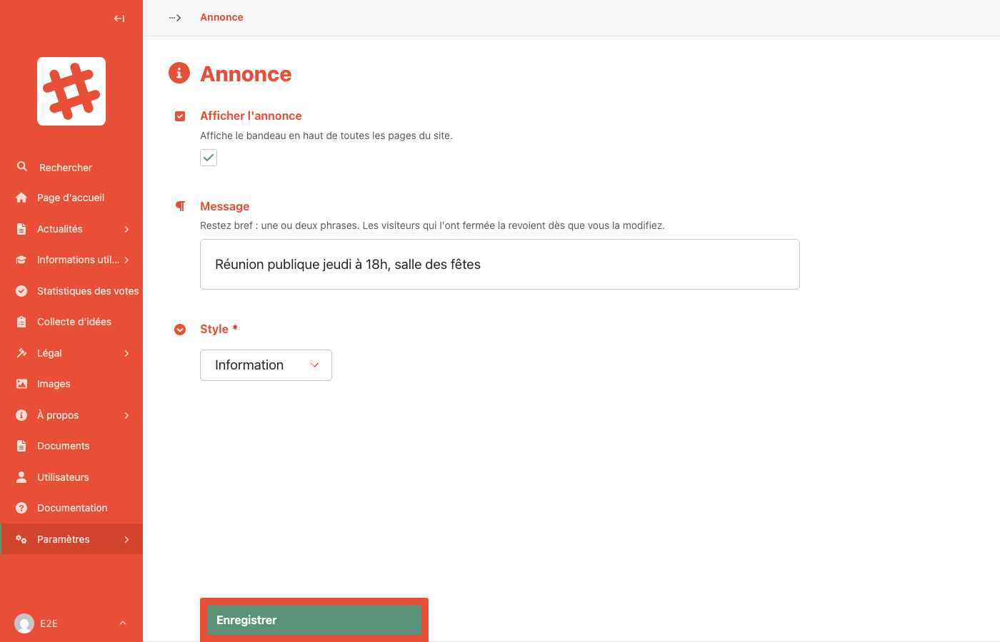

# Annonce en haut du site

Un **bandeau d'annonce** peut s'afficher en haut de toutes les pages du site : une réunion publique, des travaux, une consultation qui se termine…

## Modifier l'annonce

Dans la barre latérale, ouvrez **Paramètres** puis **Annonce**.

| Champ | Description |
|---|---|
| **Afficher l'annonce** | Cochez pour afficher le bandeau, décochez pour le retirer |
| **Message** | Une ou deux phrases. Le gras, l'italique et les liens sont possibles |
| **Style** | **Information** (bleu), **Avertissement** (jaune) ou **Important** (rouge) |

Cliquez sur **Enregistrer** : le bandeau est en ligne immédiatement, sans étape de publication.

## Fermeture par les visiteurs

Les visiteurs peuvent fermer le bandeau avec la croix. Il reste fermé pour eux **jusqu'à ce que vous changiez le message ou le style** : toute modification le fait réapparaître pour tout le monde.

> **Conseil :** Même une correction d'orthographe fait réapparaître le bandeau. Relisez le message avant d'enregistrer.

## Qui peut la modifier ?

Les modérateurs et les administrateurs.
