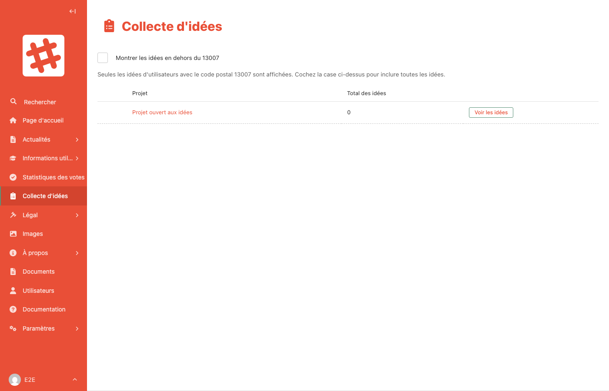

# Collecte d'idées

Un projet en **mode « Collecte d'idées »** invite les habitants à proposer leurs idées plutôt qu'à voter. C'est utile quand le projet n'est pas encore figé (voir [Projets](publications/projets.md#mode-de-participation)).

## Consulter les idées

Dans la barre latérale, ouvrez **Participation** puis cliquez sur **Idées**. Les collectes en cours apparaissent aussi sur le tableau de bord, dans « Consultations à suivre ».

Le tableau liste les projets en collecte d'idées, avec le **nombre d'idées** reçues. Cliquez sur **Voir les idées** pour lire les propositions d'un projet.

### Filtre géographique

Comme pour les votes, seules les idées des habitants du **code postal 13007** sont affichées par défaut. Cochez **« Montrer les idées en dehors du 13007 »** pour toutes les voir.

## Qui peut proposer une idée ?

Toute personne inscrite sur le site, dont l'adresse email est confirmée et qui a accepté la [charte de bonne conduite](legal.md). Une personne peut modifier ou retirer son idée tant que la collecte est ouverte.

## Rendre compte aux participants

Quand les idées ont été lues et regroupées, publiez une synthèse dans le **Suivi du projet** (voir [Projets](publications/projets.md#suivi-du-projet)). Les participants qui l'ont demandé en sont prévenus par email.
