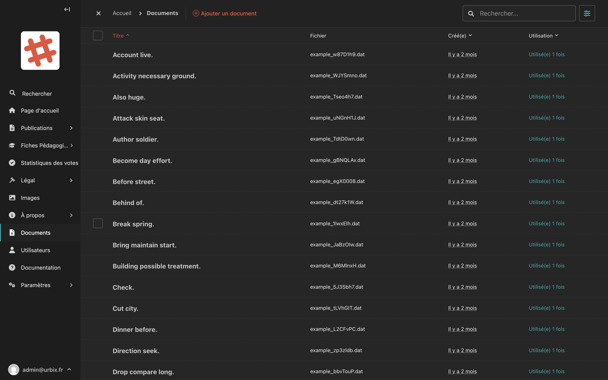

# Bibliothèque de documents

La bibliothèque de documents vous permet de stocker et gérer des fichiers téléchargeables (PDF, Word, Excel, etc.) que vous pouvez ensuite lier dans vos pages.

## Accéder à la bibliothèque

Dans la barre latérale, cliquez sur **Documents**.

## Vue de la bibliothèque

<!-- Capture d'écran : liste des documents avec les colonnes Titre, Fichier, Créé(e), Utilisation -->

La liste affiche pour chaque document :

| Colonne | Description |
|---|---|
| **Titre** | Le nom du document |
| **Fichier** | Le nom du fichier original |
| **Créé(e)** | La date d'ajout |
| **Utilisation** | Le nombre de fois où ce document est lié dans le site |

### Rechercher un document

Utilisez la **barre de recherche** en haut à droite pour filtrer les documents par titre.

## Ajouter un document

1. Cliquez sur **"Ajouter un document"** en haut de la page.
2. Choisissez le fichier à uploader depuis votre ordinateur.
3. Donnez-lui un titre clair et descriptif.
4. Cliquez sur **"Enregistrer"**.

> **Conseil :** Choisissez des noms de fichiers et des titres explicites pour retrouver facilement vos documents (ex : "Plan de quartier 2025 — Vieux-Port" plutôt que "document_final_v3").

## Modifier un document

Cliquez sur le titre d'un document pour accéder à sa fiche de modification. Vous pouvez :
- Modifier son **titre**
- Remplacer le **fichier** par une version mise à jour (le lien sur le site reste le même)

## Supprimer un document

> **Attention :** Supprimer un document le rend inaccessible partout où il était lié sur le site. Vérifiez son utilisation avant de supprimer.

## Utiliser un document dans une page

Une fois un document ajouté à la bibliothèque, vous pouvez y faire référence depuis n'importe quelle page. Dans l'éditeur de texte, utilisez l'option **"Insérer un lien > Document"** pour créer un lien de téléchargement.

Pour les **fiches pédagogiques**, vous pouvez aussi référencer le lien URL du document dans le champ "Ressource".
