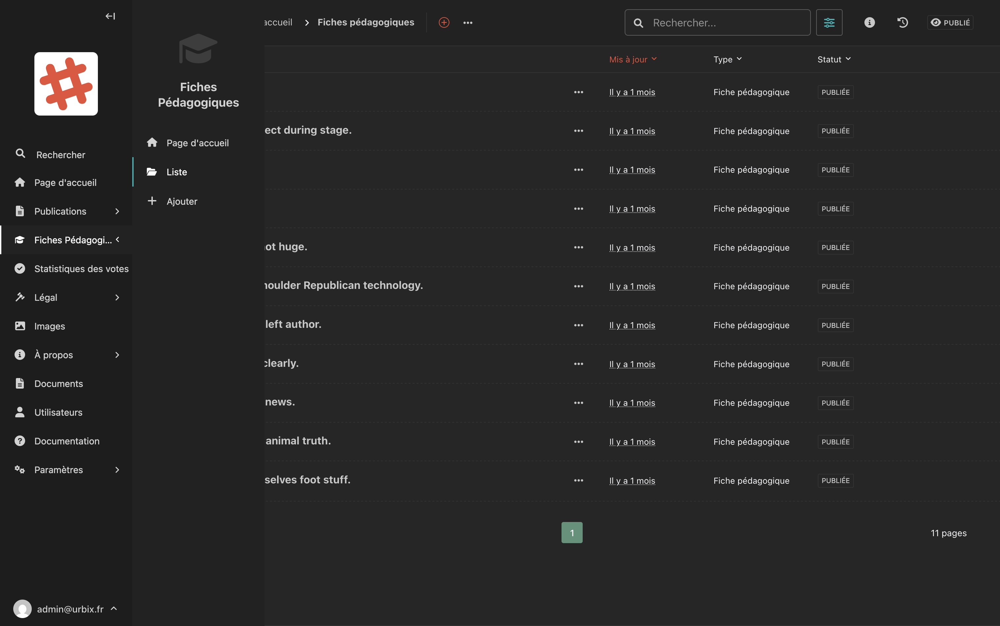
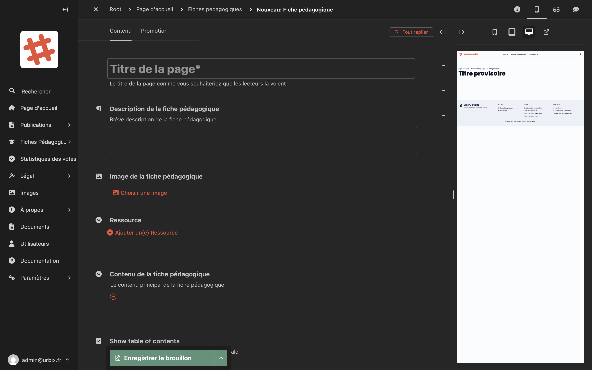

# Fiches pédagogiques

Les **fiches pédagogiques** sont des contenus documentaires destinés à informer et éduquer les citoyens sur des thématiques urbaines. Elles peuvent inclure des ressources à télécharger.

## Accéder aux fiches pédagogiques

Dans la barre latérale, cliquez sur **Fiches pédagogiques**, puis choisissez :

- **Liste** : voir toutes les fiches existantes
- **Ajouter** : créer une nouvelle fiche

## La liste des fiches

<!-- Capture d'écran : liste des fiches pédagogiques avec les colonnes Titre, Mis à jour, Type, Statut -->

La liste affiche le titre de chaque fiche, sa date de mise à jour et son statut (Publiée / Brouillon).

## Créer une fiche pédagogique

1. Cliquez sur **Fiches pédagogiques > Ajouter**.
2. Remplissez les champs du formulaire.
3. Enregistrez ou publiez.

## Les champs du formulaire

### Titre
Le titre de la fiche tel qu'il apparaîtra sur le site.

### Description de la fiche pédagogique
Un résumé court qui s'affiche dans les listes et les vignettes. Décrivez en quelques mots le sujet de la fiche.

### Image de la fiche pédagogique
Une image de couverture représentant la fiche. Elle peut être une photo, une illustration ou une capture du document.

<!-- Capture d'écran : haut du formulaire avec le titre, la description et l'image -->

### Ressources

La section **Ressources** permet d'ajouter des fichiers à télécharger liés à la fiche (PDF, documents Word, etc.).

Pour chaque ressource, renseignez :
- **URL externe** : le lien vers le fichier à télécharger

Pour ajouter plusieurs ressources, cliquez sur le bouton **"+"** pour ajouter une nouvelle ligne.

> **Astuce :** Si vous souhaitez héberger un document directement sur le site, commencez par l'ajouter dans la section [Documents](documents.md), puis copiez son URL.

### Corps de l'article (Contenu)
La zone de contenu principal avec l'éditeur de texte enrichi. Vous pouvez y rédiger le contenu complet de la fiche.

### Table des matières
Cochez cette option pour afficher automatiquement une table des matières basée sur les titres de votre article. Recommandé pour les fiches longues.

## Enregistrer et publier

Utilisez le bouton **"Enregistrer le brouillon"** pour sauvegarder, ou la flèche à côté pour accéder à l'option **"Publier"**.
