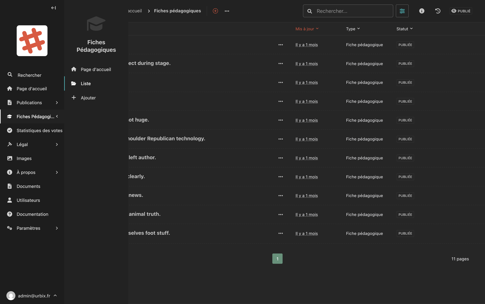
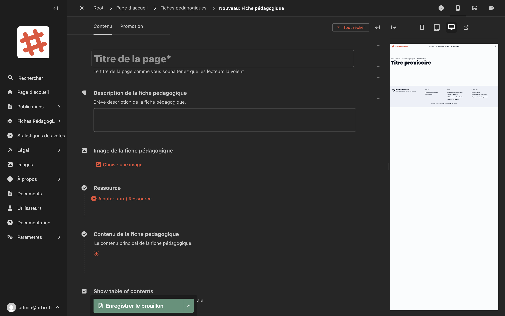

# Informations utiles

Les fiches **Informations utiles** expliquent aux habitants les notions et les démarches d'urbanisme : le PLUi, le permis de construire, comment contester un projet… Une fiche peut renvoyer vers une ressource à consulter.

## Accéder aux fiches

Dans la barre latérale, cliquez sur **Informations utiles**, puis choisissez :

- **Page « Informations utiles »** : modifier la page qui liste les fiches
- **Toutes les fiches** : voir les fiches existantes
- **Nouvelle fiche** : créer une fiche

## La page « Informations utiles »

La page qui liste les fiches se compose comme la [page d'accueil](page-accueil.md) : sous son titre et son introduction, une suite de **blocs** (sections, étapes, consultations en cours, questions, invitation à s'inscrire…).

Le bloc **Liste des fiches** affiche les fiches avec leur champ de recherche. La page en contient toujours un, et un seul : placez-le où vous voulez.

Pour repartir d'une page toute faite, utilisez un [modèle](modeles.md) : **Complète** ou **Simple** (les fiches seules).

## La liste des fiches

<!-- Capture d'écran : liste des fiches pédagogiques avec les colonnes Titre, Mis à jour, Type, Statut -->

La liste affiche le titre de chaque fiche, sa date de mise à jour et son statut (Publiée / Brouillon).

## Créer une fiche

1. Ouvrez **Informations utiles** puis cliquez sur **Nouvelle fiche** (ou utilisez l'action rapide du tableau de bord).
2. Choisissez un **modèle** (Expliquer une notion, Guide pas à pas) ou **Partir d'une page vide**. → [Partir d'un modèle](modeles.md)
3. Remplissez les champs du formulaire.
4. Enregistrez ou publiez.

## Les champs du formulaire

### Titre
Le titre de la fiche tel qu'il apparaîtra sur le site.

### Description de la fiche
Un résumé court qui s'affiche dans les listes et les vignettes. Décrivez en quelques mots le sujet de la fiche.

### Image de la fiche
Une image de couverture représentant la fiche. Elle peut être une photo, une illustration ou une capture du document.

<!-- Capture d'écran : haut du formulaire avec le titre, la description et l'image -->

### Ressources

La section **Ressource** permet d'ajouter **une** ressource liée à la fiche : une vidéo, un document, un site de référence. Renseignez son **URL externe**.

Pour joindre plusieurs documents, ajoutez des blocs **Document** dans le contenu de la fiche.

> **Astuce :** Si vous souhaitez héberger un document directement sur le site, commencez par l'ajouter dans la section [Documents](documents.md), puis copiez son URL.

### Corps de l'article (Contenu)
La zone de contenu principal avec l'éditeur de texte enrichi. Vous pouvez y rédiger le contenu complet de la fiche.

### Table des matières
Cochez cette option pour afficher automatiquement une table des matières basée sur les titres de votre article. Recommandé pour les fiches longues.

## Enregistrer et publier

Utilisez le bouton **"Enregistrer le brouillon"** pour sauvegarder, ou la flèche à côté pour accéder à l'option **"Publier"**.
