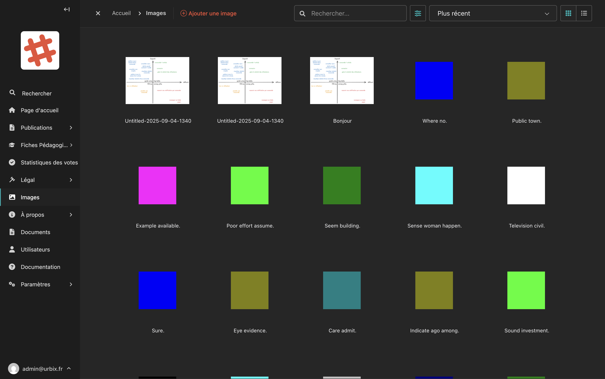
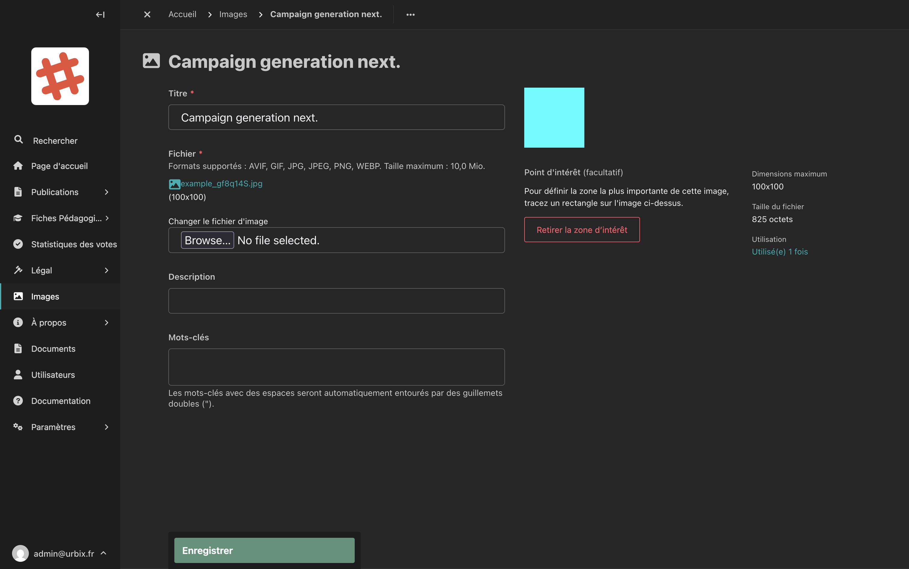

# Bibliothèque d'images

La bibliothèque d'images centralise toutes les photos et illustrations utilisées sur le site. Depuis cet espace, vous pouvez ajouter, modifier et organiser vos images.

## Accéder à la bibliothèque

Dans la barre latérale, cliquez sur **Images**.

## Vue de la bibliothèque

<!-- Capture d'écran : bibliothèque d'images en vue grille avec les vignettes -->

Les images sont affichées en **grille** par défaut. Vous pouvez passer en **vue liste** en cliquant sur l'icône correspondante en haut à droite.

### Trier et rechercher

- **Barre de recherche** : tapez un mot-clé pour filtrer les images par titre.
- **Menu de tri** : choisissez l'ordre d'affichage (Plus récent, Plus ancien, Alphabétique…).

## Ajouter une image

1. Cliquez sur **"Ajouter une image"** en haut de la page.
2. Remplissez les informations de l'image.
3. Cliquez sur **"Enregistrer"**.

### Formats acceptés

Les formats d'image acceptés sont : **AVIF, GIF, JPG, JPEG, PNG, WEBP**

Taille maximale : **10 Mo**

> **Conseil :** Privilégiez des images de bonne qualité mais dont la taille de fichier reste raisonnable (idéalement en dessous de 2 Mo) pour que le site se charge rapidement.

## Modifier une image

Cliquez sur une image dans la bibliothèque pour accéder à sa fiche de modification.

<!-- Capture d'écran : formulaire de modification d'une image avec titre, fichier, description et mots-clés -->

### Les champs de modification

| Champ | Description |
|---|---|
| **Titre** | Le nom de l'image tel qu'il apparaît dans la bibliothèque |
| **Changer le fichier d'image** | Remplacer le fichier par une nouvelle version |
| **Description** | Une description textuelle de l'image (utile pour l'accessibilité) |
| **Mots-clés** | Des mots-clés pour faciliter la recherche. Entourez de guillemets les mots-clés contenant des espaces (ex : `"centre ville"`) |

### Point d'intérêt (recadrage automatique)

Le **point d'intérêt** vous permet de définir la zone la plus importante de l'image. Ainsi, lorsque l'image est affichée dans différents formats (vignette, bannière…), le recadrage automatique préservera toujours cette zone.

Pour définir un point d'intérêt :
1. Tracez un rectangle sur la prévisualisation de l'image en maintenant le clic enfoncé.
2. Cliquez sur **"Enregistrer"**.

### Informations de l'image

À droite de la fiche, vous pouvez consulter :
- Les **dimensions** de l'image (en pixels)
- La **taille** du fichier
- Le nombre de fois où l'image est **utilisée** sur le site (cliquez sur ce lien pour voir où)

## Supprimer une image

> **Attention :** Avant de supprimer une image, vérifiez qu'elle n'est plus utilisée sur le site. La supprimer alors qu'elle est intégrée dans une page créera un espace vide.

Pour supprimer, ouvrez la fiche de l'image et cliquez sur **"Actions > Supprimer"**.
