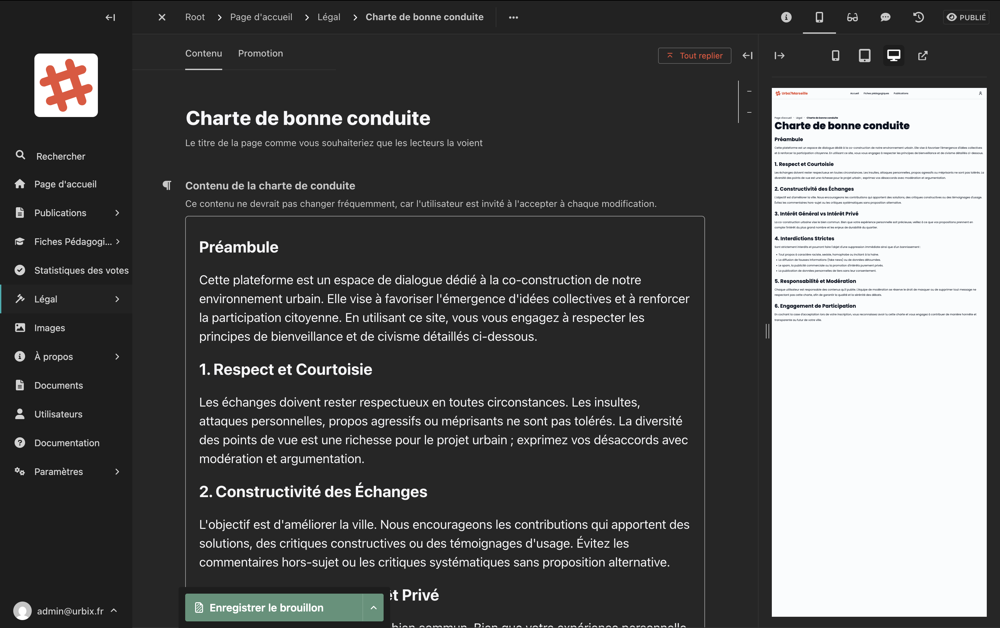

# Pages légales

La section **Légal** regroupe les documents légaux obligatoires du site. Ces pages sont accessibles aux visiteurs depuis le pied de page du site.

## Les quatre pages légales

| Page | Description |
|---|---|
| **Charte de bonne conduite** | Les règles à respecter pour utiliser la plateforme. Les utilisateurs doivent l'accepter lors de certaines actions. |
| **Conditions d'utilisation** | Les conditions générales d'utilisation du service |
| **Politique de cookies** | L'information sur les cookies utilisés par le site |
| **Politique de confidentialité** | L'information sur la collecte et l'utilisation des données personnelles |

## Accéder aux pages légales

Dans la barre latérale, cliquez sur **Légal** pour déployer le sous-menu, puis cliquez sur la page à modifier.

## Modifier une page légale

Chaque page légale a la même structure :

<!-- Capture d'écran : formulaire d'édition d'une page légale avec le titre et le contenu riche -->

| Champ | Description |
|---|---|
| **Titre** | Le titre de la page |
| **Contenu** | Le texte complet du document, avec l'éditeur de texte enrichi |

### Attention à la charte de bonne conduite

La charte de bonne conduite a un comportement particulier : **chaque fois que vous la modifiez et la publiez, les utilisateurs seront invités à l'accepter à nouveau** lors de leur prochaine connexion. Évitez donc de publier des modifications mineures (corrections d'orthographe, reformulations légères) trop fréquemment.

> **Conseil :** Pour des ajustements mineurs (fautes d'orthographe), enregistrez d'abord en brouillon et regroupez plusieurs petites corrections avant de publier.

## Enregistrer et publier

Cliquez sur **"Enregistrer le brouillon"** pour sauvegarder, puis sur **"Publier"** pour mettre à jour le document en ligne.
