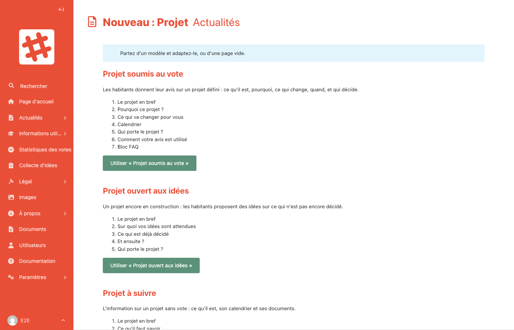

# Partir d'un modèle

Pour ne pas partir d'une page blanche, les **projets**, les **événements**, les **fiches « Informations utiles »** et la **page d'accueil** proposent des modèles : une page déjà structurée, avec un texte qui indique quoi écrire dans chaque partie.

## En créant une page

Quand vous ajoutez un projet, un événement ou une fiche, une page de choix s'affiche avant le formulaire.

- Chaque modèle présente sa description et la liste de ses parties.
- Cliquez sur **Utiliser « … »** : le formulaire s'ouvre, déjà rempli avec les parties du modèle.
- Ou cliquez sur **Partir d'une page vide** pour un formulaire vierge.

Rien n'est enregistré tant que vous n'avez pas cliqué sur **Enregistrer le brouillon** ou **Publier**. Le titre, le résumé et l'image restent à renseigner.

Les textes du modèle sont des **consignes** (« Décrivez en deux ou trois phrases… ») : remplacez-les par votre texte, et supprimez les parties dont vous n'avez pas besoin.

### Les modèles disponibles

| Type de page | Modèles |
|---|---|
| **Projet** | Projet soumis au vote · Projet ouvert aux idées · Projet à suivre |
| **Événement** | Réunion publique · Atelier participatif · Balade urbaine |
| **Informations utiles** | Expliquer une notion · Guide pas à pas |
| **Page d'accueil** | Participation · L'essentiel |

Pour un projet, le modèle règle aussi le **mode de participation** (vote, idées ou aucune participation). Vous pouvez le changer ensuite.

## Sur une page existante

Dans le formulaire d'une page, ouvrez le menu **···** à côté du titre en haut de l'écran, puis choisissez **Partir d'un modèle**.

Le modèle remplace le **contenu** de la page dans un **nouveau brouillon** :

- rien ne change sur le site tant que vous n'avez pas publié ;
- la version précédente reste dans l'**historique** de la page (icône horloge), d'où vous pouvez la restaurer ;
- le titre, le résumé, l'image et les autres réglages ne changent pas. Sur la page d'accueil, le bandeau principal et sa photo sont conservés.
