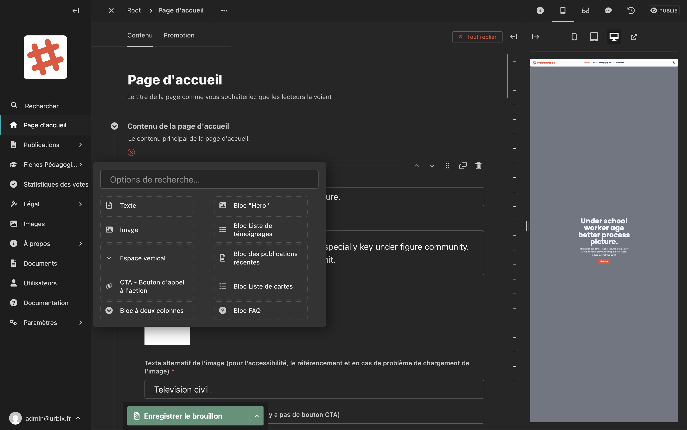

# Page d'accueil

La **page d'accueil** est la première page que voient les visiteurs du site. Elle est composée de plusieurs blocs que vous pouvez personnaliser.

## Accéder à l'édition de la page d'accueil

Dans la barre latérale, cliquez sur **Page d'accueil**.

Vous pouvez aussi accéder à l'édition depuis le menu **Publications > Page d'accueil**.

## Structure de la page d'accueil

La page d'accueil est composée d'une série de **blocs de contenu** que vous pouvez réorganiser, modifier ou supprimer.

<!-- Capture d'écran : formulaire d'édition de la page d'accueil avec les différents blocs -->

### Le bloc "Hero"

Le bloc Hero est le **bandeau principal** en haut de la page d'accueil. Il comporte :

| Champ | Description |
|---|---|
| **Titre** | Le titre principal affiché en grand sur le bandeau |
| **Sous-titre** (optionnel) | Un texte court affiché sous le titre |
| **Image de fond** | La photo d'arrière-plan du bandeau |

C'est l'élément le plus visible du site — choisissez une image de qualité et un titre accrocheur.

### Les autres blocs

La page d'accueil peut contenir d'autres blocs selon sa configuration. Chaque bloc a ses propres champs et peut être réorganisé en le faisant glisser (icône ⠿) ou en utilisant les flèches ↑ ↓.

## Modifier un bloc

1. Cliquez sur le bloc que vous souhaitez modifier pour le déplier.
2. Modifiez les champs.
3. Enregistrez ou publiez.

## Réorganiser les blocs

Utilisez les **flèches ↑ ↓** ou faites glisser le bloc à l'aide de l'icône **⠿** pour changer l'ordre d'affichage.

## Supprimer un bloc

Cliquez sur l'icône **🗑** (corbeille) à droite du bloc à supprimer.

> **Attention :** La suppression est immédiate et non annulable dans la même session. Si vous publiez par erreur, consultez l'[historique des versions](#) pour restaurer une version précédente.

## Enregistrer et publier

Utilisez le bouton **"Enregistrer le brouillon"** pour sauvegarder vos modifications sans les mettre en ligne, puis **"Publier"** pour les rendre visibles.
