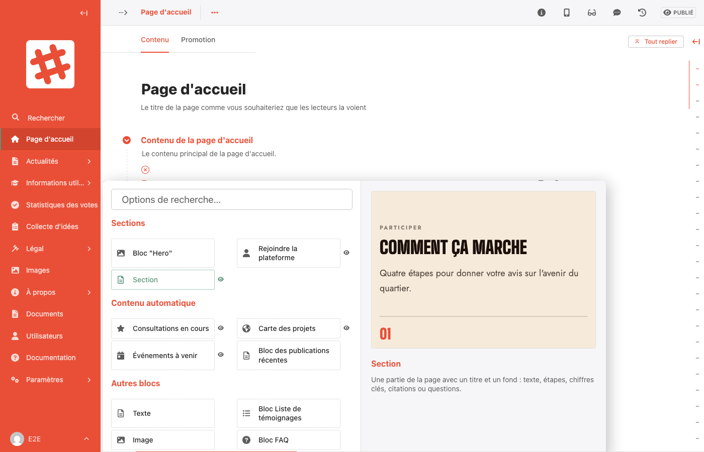

# Page d'accueil

La **page d'accueil** est la première page que voient les visiteurs. Elle est faite de **blocs** que vous ajoutez, réorganisez et modifiez.

## Accéder à l'édition

Dans la barre latérale, cliquez sur **Page d'accueil**.

## Partir d'un modèle

Deux pages d'accueil toutes prêtes sont proposées dans le menu **···** en haut du formulaire, **Partir d'un modèle** :

- **Participation** : la page complète (qui sommes-nous, consultations en cours, comment ça marche, chiffres clés, agenda, carte, publications, CIQ, questions, inscription) ;
- **L'essentiel** : une page courte centrée sur l'actualité.

Le modèle est enregistré en **brouillon**, votre bandeau principal et sa photo sont conservés. Adaptez les textes, prévisualisez, puis publiez. → [Partir d'un modèle](modeles.md)

## Ajouter un bloc

Cliquez sur le **+** entre deux blocs. Les blocs sont classés en trois familles. Un clic sur l'icône **œil** à côté d'un bloc affiche un **aperçu** et une description.

### Sections

| Bloc | Usage |
|---|---|
| **Bloc « Hero »** | Le bandeau principal, avec une grande photo et le titre du site. Placez-le en premier |
| **Section** | Une partie de page avec un petit libellé, un titre, une introduction et un fond. Elle contient du texte, des étapes, des chiffres clés, des citations, des questions-réponses, une image ou un bouton |
| **Rejoindre la plateforme** | Une invitation à créer un compte. Les membres déjà connectés voient à la place un lien vers leurs notifications |

Réglages d'une section :

- **Fond** : *Uni*, *Sable* ou *Bleu marine*. Alterner les fonds rythme la page ;
- **Mise en page** : titre au-dessus du contenu, ou titre à gauche et contenu à droite (idéal pour un texte de présentation).

Contenus d'une section :

| Contenu | Usage |
|---|---|
| **Texte** | Paragraphes, intertitres, listes, liens |
| **Étapes** | De deux à six étapes numérotées, par exemple « comment participer » |
| **Chiffres clés** | De deux à quatre grands chiffres. Choisissez un chiffre **compté automatiquement** (projets publiés, votes exprimés, idées proposées, personnes ayant participé, membres inscrits, événements, consultations en cours) ou saisissez un nombre |
| **Citations** | Jusqu'à trois témoignages d'habitants, avec leur nom et leur quartier |
| **Questions et réponses** | Une liste de questions qui se déplient |

### Contenu automatique

Ces blocs se remplissent tout seuls à partir du site : la page reste à jour sans que vous ayez à la modifier.

| Bloc | Ce qu'il affiche |
|---|---|
| **Consultations en cours** | Les projets ouverts au vote ou aux idées, ceux qui ferment le plus tôt en premier. **Masqué quand aucune consultation n'est ouverte** |
| **Événements à venir** | Les prochains événements. **Masqué quand aucun n'est prévu** |
| **Carte des projets** | Les projets localisés, sur la carte du quartier |
| **Bloc des publications récentes** | Les dernières publications |

### Autres blocs

Les blocs plus anciens (texte libre, image, deux colonnes, cartes, témoignages, FAQ, espace vertical, bouton) restent disponibles. Préférez les sections, plus lisibles.

## Réorganiser et supprimer

- Changez l'ordre avec les **flèches ↑ ↓** ou en faisant glisser l'icône **⠿**.
- Supprimez un bloc avec l'icône **corbeille**.

## Enregistrer et publier

**Enregistrer le brouillon** sauvegarde sans mettre en ligne. **Publier** rend la page visible. Utilisez **Aperçu** (icône œil en haut) pour vérifier le rendu avant de publier.

> **En cas d'erreur :** l'historique (icône horloge) garde toutes les versions publiées. Vous pouvez y revenir à tout moment.
