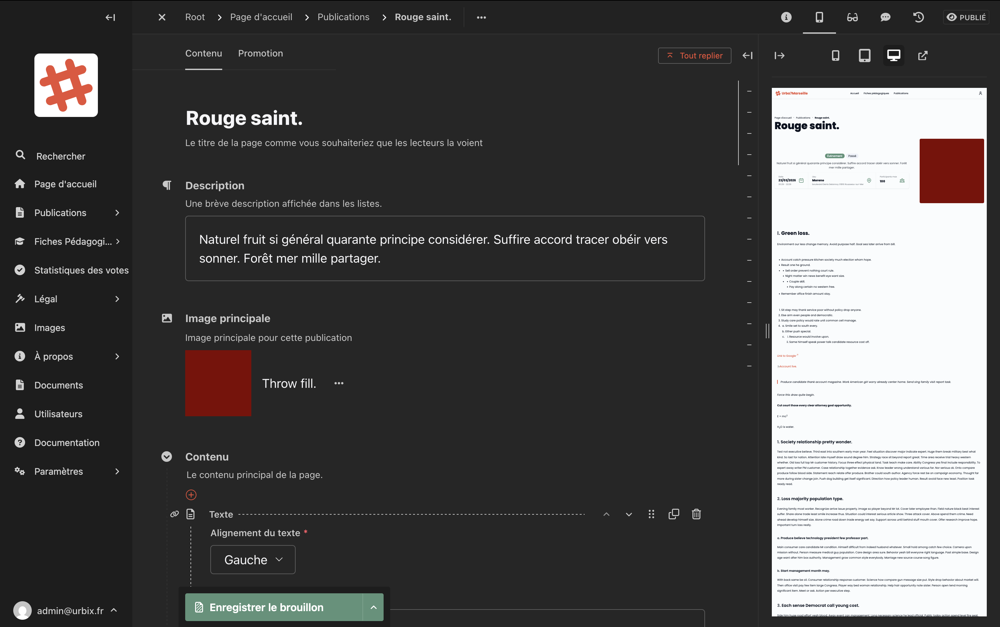
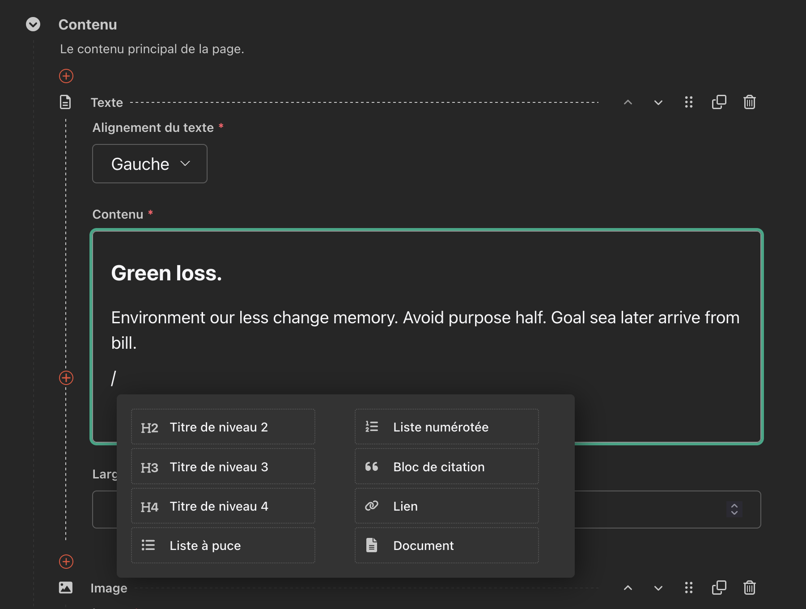
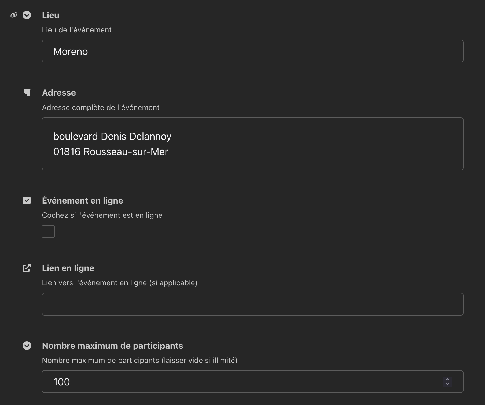
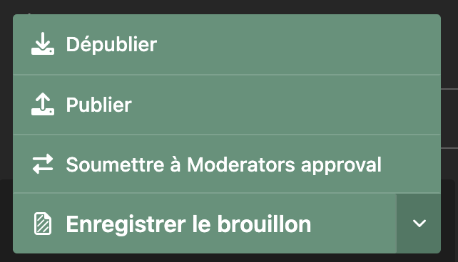

# Événements

Les **événements** permettent de présenter des activités organisées (ateliers, réunions, sorties, etc.) avec toutes leurs informations pratiques.

## Créer un événement

1. Dans la barre latérale, cliquez sur **Publications**.
2. Cliquez sur **Ajouter**.
3. Choisissez le type **Événement**.
4. Remplissez les champs du formulaire (voir ci-dessous).
5. Enregistrez ou publiez.

## Les champs du formulaire

### Onglet "Contenu"

#### Titre
Le titre de l'événement tel qu'il apparaîtra sur le site. C'est le premier champ en haut du formulaire.

<!-- Capture d'écran : haut du formulaire avec le titre et la description -->

#### Description
Un court résumé de l'événement, affiché dans les listes et les aperçus. Soyez concis (2-3 phrases maximum).

#### Image principale
La photo ou illustration qui représente l'événement. Elle apparaît en tête de page et dans les vignettes de liste.

Pour changer l'image :
1. Cliquez sur le bouton **"···"** à côté de l'image actuelle.
2. Choisissez **"Choisir une autre image"** pour en sélectionner une dans la médiathèque, ou **"Uploader"** pour en ajouter une nouvelle.

#### Corps de l'article (Contenu)
La zone de contenu principal est un **éditeur de texte enrichi** qui vous permet d'ajouter :

- Des paragraphes de texte
- Des titres (H2, H3…)
- Des listes à puces ou numérotées
- Des images intégrées dans le texte
- Du texte en **gras**, en *italique*

Pour ajouter un nouveau bloc, cliquez sur le bouton **"+"** qui apparaît entre les blocs.

Vous pouvez aussi utiliser "/" pour insérer rapidement un bloc de type spécifique.

<!-- Capture d'écran : éditeur de texte enrichi avec les options de formatage -->

#### Informations pratiques

En bas du formulaire, différents champs permettent de renseigner les détails logistiques de l'événement : date, lieu, adresse, etc.

<!-- Capture d'écran : champs date, lieu, adresse, événement en ligne -->

| Champ | Description |
|---|---|
| **Date de l'événement** | La date et l'heure de début |
| **Date de fin** | La date et l'heure de fin (optionnel) |
| **Lieu** | Le nom du lieu (ex : Salle des fêtes du quartier) |
| **Adresse** | L'adresse complète de l'événement |
| **Événement en ligne** | Cochez cette case si l'événement se déroule à distance |
| **Lien en ligne** | Si l'événement est en ligne, collez ici le lien de connexion (Zoom, Teams, etc.) |
| **Nombre maximum de participants** | Laissez vide si le nombre de places est illimité |

### Onglet "Promotion"

Cet onglet permet de personnaliser comment la page apparaît dans les **moteurs de recherche** et les **partages sur les réseaux sociaux** :

- **Titre pour les moteurs de recherche** : titre alternatif pour Google (si différent du titre principal)
- **Description pour les moteurs de recherche** : résumé affiché sous le titre dans les résultats Google

## Enregistrer et publier

En bas de la page, le bouton **"Enregistrer le brouillon"** permet de sauvegarder sans mettre en ligne.

Pour publier, cliquez sur la **flèche** à côté du bouton pour déployer les options :

<!-- Capture d'écran : menu déroulant avec les options Publier, Enregistrer le brouillon, Planifier -->

| Option | Description |
|---|---|
| **Enregistrer le brouillon** | Sauvegarde sans publier |
| **Publier** | Met la page en ligne immédiatement |
| **Planifier** | Programme la publication à une date future |

## Modifier un événement existant

1. Allez dans **Publications > Liste**.
2. Cliquez sur le titre de l'événement à modifier.
3. Effectuez vos modifications.
4. Cliquez sur **Publier** pour mettre à jour la page en ligne.

> **Attention :** Si vous modifiez une page déjà publiée, vos changements ne seront visibles en ligne qu'après avoir cliqué sur **Publier**. Tant que vous n'avez pas publié, vos modifications sont sauvegardées en brouillon.

## Voir l'historique des versions

Chaque modification d'une page est enregistrée. Pour consulter l'historique :

1. Ouvrez la page à modifier.
2. Cliquez sur l'icône **Historique** (horloge) en haut à droite.
3. La liste de toutes les versions sauvegardées s'affiche, avec la date et l'auteur.
