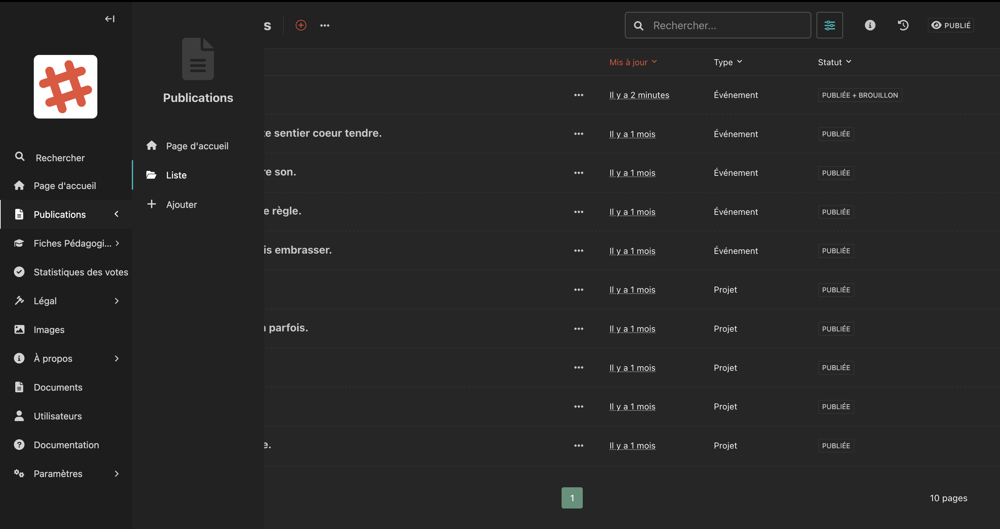

# Publications

La section **Publications** regroupe l'ensemble du contenu éditorial du site : les **événements** et les **projets**.

<!-- Capture d'écran : liste des publications avec les colonnes Titre, Mis à jour, Type, Statut -->

## Accéder aux publications

Dans la barre latérale, cliquez sur **Publications** pour déployer le sous-menu, puis choisissez :

- **Page d'accueil** : modifier la page de liste des publications
- **Liste** : voir toutes les publications existantes
- **Ajouter** : créer une nouvelle publication

## La liste des publications

La liste affiche pour chaque publication :

| Colonne | Description |
|---|---|
| **Titre** | Le titre de la publication |
| **Mis à jour** | La date de dernière modification |
| **Type** | Événement ou Projet |
| **Statut** | Publiée, Brouillon, ou Publiée + Brouillon |

### Trier et filtrer

- Cliquez sur un **en-tête de colonne** pour trier la liste.
- Utilisez la **barre de recherche** en haut à droite pour filtrer par titre.
- Cliquez sur l'icône de **filtre** pour filtrer par statut ou type.

### Actions sur une publication

Chaque ligne dispose d'un bouton **"···"** (trois points) qui ouvre un menu avec les options :

- **Modifier** : ouvrir le formulaire d'édition
- **Voir sur le site** : visualiser la page publiée
- **Historique** : consulter l'historique des versions

## Les deux types de publications

### Événements

Les événements sont des activités avec une **date, un lieu et un nombre de participants**. Ils peuvent être en présentiel ou en ligne.

→ [Voir le guide des événements](evenements.md)

### Projets

Les projets sont des contenus de fond qui peuvent inclure un **système de vote** permettant aux citoyens de s'exprimer.

→ [Voir le guide des projets](projets.md)

## Statuts d'une publication

| Statut | Signification |
|---|---|
| **PUBLIÉE** | La page est visible par tous les visiteurs du site |
| **BROUILLON** | La page n'est pas encore visible en ligne |
| **PUBLIÉE + BROUILLON** | Une version est publiée, et une nouvelle version est en cours de modification |
