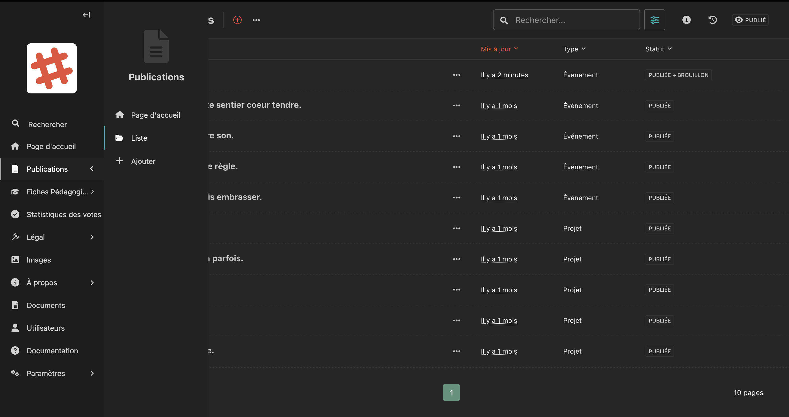

# Actualités : projets et événements

La section **Actualités** regroupe le contenu éditorial du site : les **projets** et les **événements**. Sur le site, ils sont listés dans la page « Actualités », avec des filtres par type et par catégorie, une recherche et la carte des projets.

<!-- Capture d'écran : liste des publications avec les colonnes Titre, Mis à jour, Type, Statut -->

## Accéder aux publications

Dans la barre latérale, cliquez sur **Actualités** pour déployer le sous-menu, puis choisissez :

- **Page « Actualités »** : modifier la page « Actualités » elle-même (voir ci-dessous)
- **Toutes les publications** : voir les projets et événements existants
- **Nouveau projet** et **Nouvel événement** : créer une publication, à partir d'un [modèle](../modeles.md) ou d'une page vide

## La page « Actualités »

La page « Actualités » se compose comme la [page d'accueil](../page-accueil.md) : sous son titre et son introduction, une suite de **blocs** (sections, consultations en cours, prochains rendez-vous, carte des projets, questions, invitation à s'inscrire…).

Le bloc **Liste des publications** affiche les projets et événements, avec la recherche, les filtres et les liens pour suivre l'actualité. La page en contient toujours un, et un seul : placez-le où vous voulez, et donnez-lui si besoin un petit titre et un titre.

Pour repartir d'une page toute faite, utilisez un [modèle](../modeles.md) : **Complète** ou **Simple** (la liste et la carte).

## La liste des publications

La liste affiche pour chaque publication :

| Colonne | Description |
|---|---|
| **Titre** | Le titre de la publication |
| **Mis à jour** | La date de dernière modification |
| **Type** | Événement ou Projet |
| **Statut** | Publiée, Brouillon, ou Publiée + Brouillon |

### Trier et filtrer

- Cliquez sur un **en-tête de colonne** pour trier la liste.
- Utilisez la **barre de recherche** en haut à droite pour filtrer par titre.
- Cliquez sur l'icône de **filtre** pour filtrer par statut ou type.

### Actions sur une publication

Chaque ligne dispose d'un bouton **"···"** (trois points) qui ouvre un menu avec les options :

- **Modifier** : ouvrir le formulaire d'édition
- **Voir sur le site** : visualiser la page publiée
- **Historique** : consulter l'historique des versions

## Les deux types de publications

### Événements

Les événements sont des rendez-vous avec une **date et un lieu** : réunion publique, atelier, balade… Ils peuvent être en présentiel ou en ligne.

→ [Voir le guide des événements](evenements.md)

### Projets

Les projets présentent les aménagements du quartier. Les habitants peuvent **voter** ou **proposer des idées**, et suivre leur avancement.

→ [Voir le guide des projets](projets.md)

## Statuts d'une publication

| Statut | Signification |
|---|---|
| **PUBLIÉE** | La page est visible par tous les visiteurs du site |
| **BROUILLON** | La page n'est pas encore visible en ligne |
| **PUBLIÉE + BROUILLON** | Une version est publiée, et une nouvelle version est en cours de modification |
