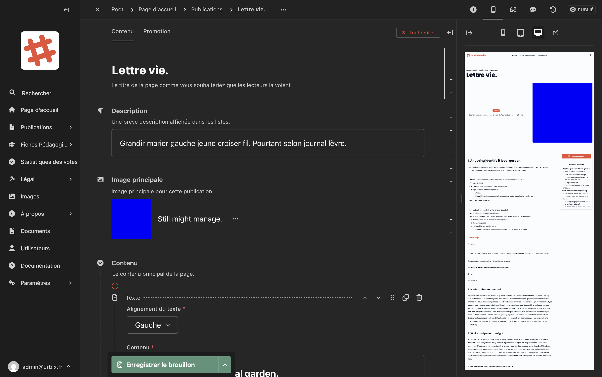
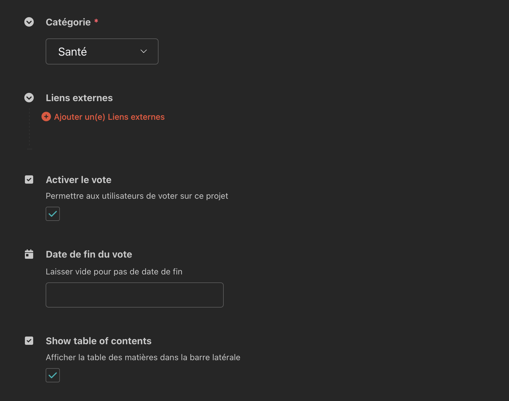

# Projets

Les **projets** sont des publications de fond qui présentent des initiatives urbaines, des aménagements ou des consultations. Ils peuvent intégrer un **système de vote** permettant aux citoyens de donner leur avis.

## Créer un projet

1. Dans la barre latérale, cliquez sur **Publications**.
2. Cliquez sur **Ajouter**.
3. Choisissez le type **Projet**.
4. Remplissez les champs du formulaire.
5. Enregistrez ou publiez.

## Les champs du formulaire

### Onglet "Contenu"

#### Titre
Le titre du projet tel qu'il apparaîtra sur le site.

#### Description
Un court résumé du projet, affiché dans les listes et les vignettes. Soyez concis.

#### Image principale
La photo ou illustration représentant le projet.

#### Corps de l'article (Contenu)
La zone de contenu principal est un **éditeur de texte enrichi** identique à celui des événements. Vous pouvez y insérer du texte, des titres, des listes et des images.

<!-- Capture d'écran : formulaire de projet avec le titre, la description et l'éditeur de contenu -->

#### Catégorie
Permet de classer le projet dans une catégorie thématique pour faciliter la navigation.

#### Liens externes
Vous pouvez ajouter des liens vers des ressources externes liées au projet (études, sites partenaires, etc.). Chaque lien comporte :
- **URL** : l'adresse du lien
- **Texte d'affichage** : le texte cliquable visible par les visiteurs

#### Table des matières
Cochez cette option pour afficher automatiquement une **table des matières** basée sur les titres présents dans le corps de l'article. Très utile pour les projets longs.

### Activer le vote citoyen

Le système de vote permet aux habitants de soutenir ou de s'opposer à un projet.

<!-- Capture d'écran : champs Activer le vote et Date de fin du vote -->

| Champ | Description |
|---|---|
| **Activer le vote** | Cochez pour ouvrir le vote sur ce projet |
| **Date de fin du vote** | La date à laquelle le vote se clôture automatiquement |

> **Important :** Une fois la date de fin passée, le vote se clôture automatiquement. Les résultats restent consultables dans la section [Statistiques des votes](../statistiques-votes.md).

### Onglet "Promotion"

Permet de définir le titre et la description pour les moteurs de recherche et les réseaux sociaux.

## Enregistrer et publier

Identique aux événements : utilisez le bouton **"Enregistrer le brouillon"** ou la flèche pour accéder à l'option **"Publier"**.

## Consulter les votes

Pour voir les résultats de vote d'un projet, rendez-vous dans **Statistiques des votes** dans la barre latérale.

→ [Voir le guide des statistiques des votes](../statistiques-votes.md)
