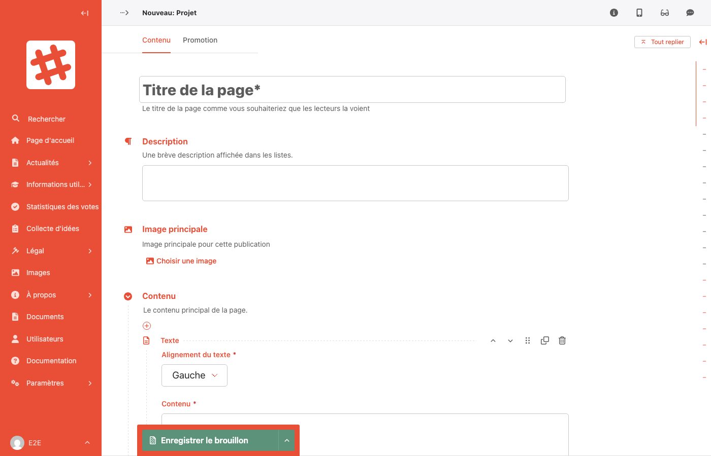
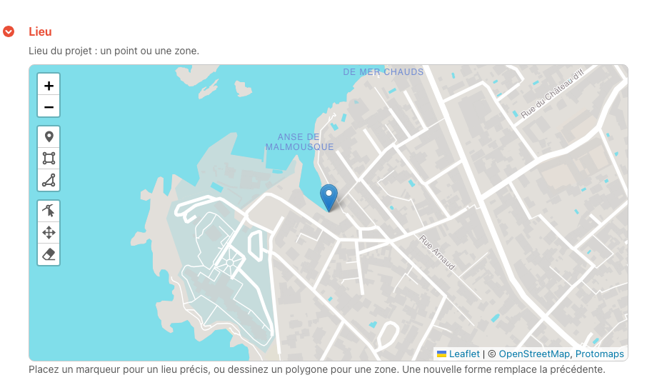
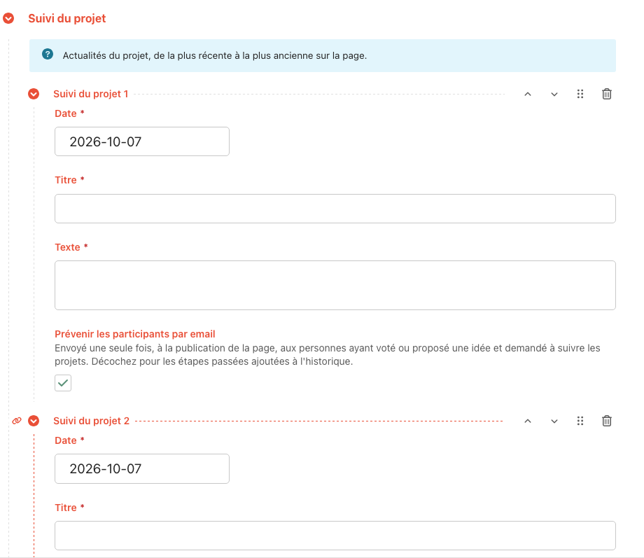

# Projets

Les **projets** présentent les aménagements et les décisions d'urbanisme du quartier. Les habitants peuvent **voter** sur un projet, ou lui **proposer des idées**, et suivre son avancement.

## Créer un projet

1. Dans la barre latérale, ouvrez **Actualités** puis cliquez sur **Ajouter**.
2. Choisissez le type **Projet**.
3. Choisissez un **modèle** (Projet soumis au vote, Projet ouvert aux idées, Projet à suivre) ou **Partir d'une page vide**. → [Partir d'un modèle](../modeles.md)
4. Remplissez le formulaire, puis enregistrez ou publiez.

## Les champs du formulaire

| Champ | Description |
|---|---|
| **Titre** | Le titre du projet sur le site |
| **Description** | Un résumé court, affiché dans les listes et sur la page d'accueil. Deux phrases suffisent |
| **Image principale** | La photo ou l'illustration du projet |
| **Contenu** | Le corps de la page : texte, intertitres, images, documents, questions-réponses… Les intertitres alimentent la table des matières |
| **Catégorie** | *Environnement*, *Cadre de vie / Espaces publics / Mobilité* ou *Formes urbaines / Logement*. Elle permet aux visiteurs de filtrer les projets |
| **Lieu** | L'emplacement du projet sur la carte (voir ci-dessous) |
| **Liens externes** | Des boutons vers des ressources extérieures (étude, site de la Métropole…), avec un texte et une adresse |
| **Suivi du projet** | Les étapes et nouvelles du projet (voir ci-dessous) |
| **Mode de participation** | Vote, collecte d'idées ou aucune participation (voir ci-dessous) |
| **Date de fin du vote** | La date de clôture du vote. Laissez vide pour un vote sans date de fin |
| **Table des matières** | Affiche une table des matières à partir des intertitres. Utile pour les projets longs |

### Lieu

Placez le projet sur la carte du quartier : il apparaît alors sur sa page et sur la carte « Projets près de chez moi ».

- **Un point** pour un lieu précis : cliquez sur l'icône marqueur, puis sur la carte.
- **Une zone** pour une rue, un îlot ou un parc : dessinez un polygone ou un rectangle.
- Les outils de la barre permettent de déplacer, modifier ou supprimer la forme. Une nouvelle forme remplace l'ancienne.

### Mode de participation

| Mode | Ce que font les habitants |
|---|---|
| **Vote** | Ils donnent leur avis (de favorable à défavorable), avec un commentaire facultatif |
| **Collecte d'idées** | Ils proposent une idée, pour un projet encore en construction → [Collecte d'idées](../collecte-idees.md) |
| **Aucune participation** | Ils consultent l'information sans réagir |

Pour participer, il faut être inscrit, avoir confirmé son adresse email et accepté la [charte de bonne conduite](../legal.md). Changer de mode ne supprime pas les réponses déjà reçues.

### Suivi du projet

Ajoutez une entrée à chaque étape importante : réunion, décision, début des travaux, synthèse des idées… Chaque entrée a une **date**, un **titre** et un **texte**. Les entrées s'affichent sur la page, de la plus récente à la plus ancienne.

La case **Prévenir les participants par email** (cochée par défaut) envoie l'entrée, **une seule fois, à la publication de la page**, aux personnes qui ont voté ou proposé une idée et qui ont demandé à recevoir les nouvelles du projet. Décochez-la quand vous ajoutez une étape passée.

## Clôture du vote et résultats

- Le vote se **ferme automatiquement** à sa date de fin.
- Pour le fermer plus tôt : dans le formulaire du projet, ouvrez le menu **···** en haut, puis **Clore le vote et envoyer les résultats**, et confirmez. Cette action est définitive.

Une fois le vote clos, tout le monde voit les **résultats** sur la page du projet, et les votants qui l'ont demandé les reçoivent par email.

→ Pour suivre les votes en cours : [Statistiques des votes](../statistiques-votes.md)

## Onglet « Promotion »

Le titre et la description pour les moteurs de recherche et les aperçus de liens sur les réseaux sociaux. Laissés vides, la description du projet et son image sont utilisées.

## Enregistrer et publier

**Enregistrer le brouillon** sauvegarde sans mettre en ligne ; **Publier** (flèche à côté du bouton) rend le projet visible. Voir aussi [Publications](index.md#statuts-dune-publication).
