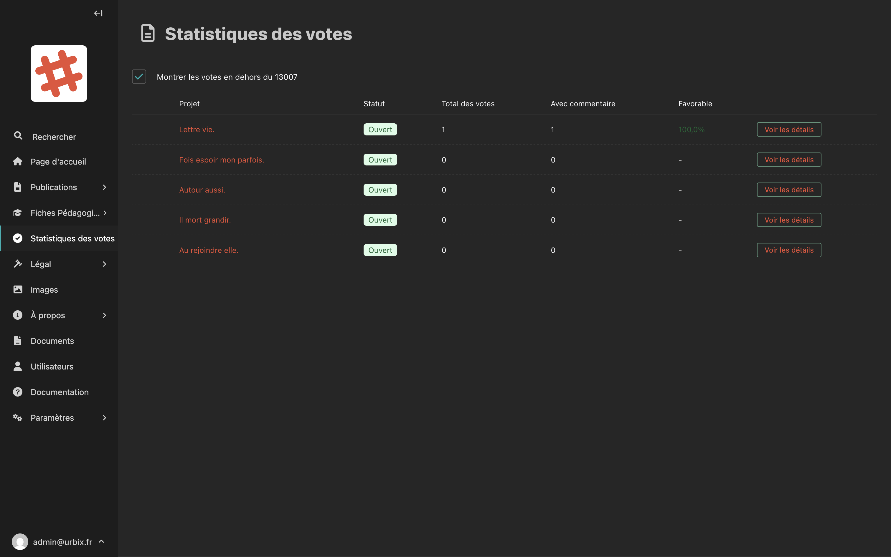
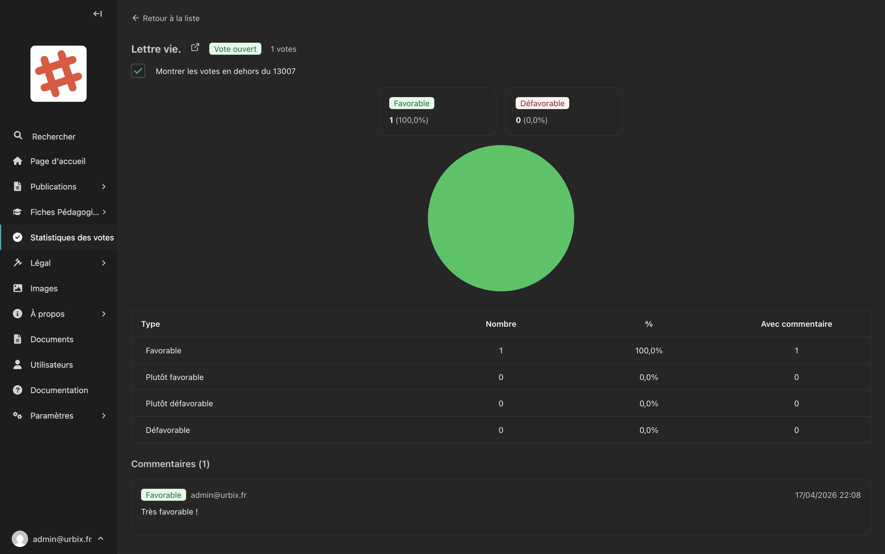

# Statistiques des votes

La section **Statistiques des votes** vous permet de consulter en temps réel les résultats des votes citoyens sur les projets.

## Accéder aux statistiques

Dans la barre latérale, cliquez sur **Statistiques des votes**.

## La vue d'ensemble

<!-- Capture d'écran : tableau listant les projets avec leurs statistiques de vote -->

Le tableau affiche pour chaque projet :

| Colonne | Description |
|---|---|
| **Projet** | Le nom du projet, cliquable pour voir le détail |
| **Statut** | **Ouvert** (vote en cours) ou **Fermé** (vote clôturé) |
| **Total des votes** | Le nombre total de votes enregistrés |
| **Avec commentaire** | Le nombre de votes accompagnés d'un commentaire |
| **Favorable** | La proportion de votes favorables |

### Filtre géographique

Par défaut, seuls les votes des habitants du **code postal 13007** sont affichés.

Cochez la case **"Montrer les votes en dehors du 13007"** pour inclure tous les votes, quelle que soit l'origine géographique.

## Voir le détail d'un projet

Cliquez sur **"Voir les détails"** (ou sur le nom du projet) pour accéder à la page de détail.

<!-- Capture d'écran : page de détail des votes d'un projet avec le statut et la liste des votes -->

La page de détail affiche :
- Le **statut** du vote (Ouvert / Fermé)
- Le **nombre total de votes**
- La liste individuelle des votes (si des votes ont été enregistrés)

> **Remarque :** Le vote se clôture automatiquement à la **date de fin** définie dans le formulaire du projet. Vous ne pouvez pas modifier directement les votes des citoyens.

## Comprendre le statut "Vote ouvert" / "Vote fermé"

| Statut | Signification |
|---|---|
| **Vote ouvert** | Les citoyens peuvent encore voter sur ce projet |
| **Vote fermé** | La date de fin est passée, les votes ne sont plus acceptés |

Pour modifier la date de clôture d'un vote, éditez le projet correspondant dans la section [Publications > Projets](publications/projets.md).
