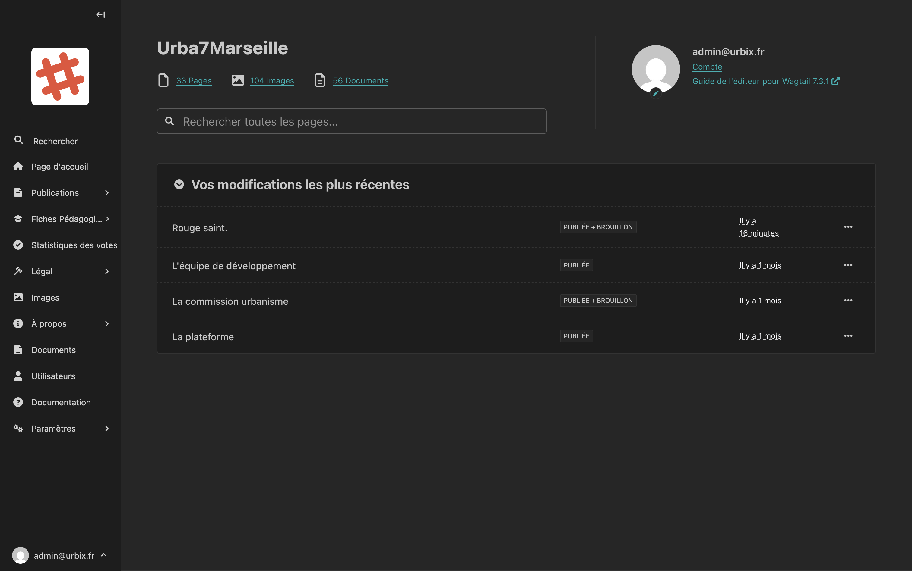

# Tableau de bord

Le tableau de bord est la première page que vous voyez après vous être connecté. Il offre une vue d'ensemble rapide de l'activité du site.

<!-- Capture d'écran : tableau de bord complet avec la barre latérale et les statistiques -->

## Les éléments du tableau de bord

### Statistiques rapides

En haut de la page, trois compteurs affichent en temps réel :

| Compteur | Ce qu'il indique |
|---|---|
| **Pages** | Le nombre total de pages publiées sur le site |
| **Images** | Le nombre d'images dans la médiathèque |
| **Documents** | Le nombre de documents disponibles |

Cliquez sur l'un de ces compteurs pour accéder directement à la section correspondante.

### Barre de recherche

La barre de recherche centrale vous permet de **retrouver rapidement une page** par son titre. Commencez à taper le nom de la page que vous recherchez et les résultats s'affichent automatiquement.

### Vos modifications les plus récentes

Cette section liste les **dernières pages que vous avez modifiées**, avec leur statut (Publiée, Brouillon) et la date de la dernière modification.

Cliquez sur le titre d'une page pour la modifier directement.

### Votre compte

En haut à droite, vous pouvez accéder à :

- **Compte** : modifier votre profil et votre mot de passe
- **Guide de l'éditeur pour Wagtail** : documentation officielle de l'outil (en anglais)

## La barre latérale

La barre latérale gauche est le menu principal de l'administration. Elle contient toutes les sections du site :

| Entrée | Description |
|---|---|
| **Rechercher** | Rechercher une page dans tout le site |
| **Page d'accueil** | Modifier la page d'accueil |
| **Publications** | Événements et projets |
| **Fiches pédagogiques** | Fiches téléchargeables |
| **Statistiques des votes** | Résultats des votes sur les projets |
| **Légal** | Charte, CGU, politiques de confidentialité |
| **Images** | Bibliothèque d'images |
| **À propos** | Pages de présentation |
| **Documents** | Bibliothèque de documents |
| **Utilisateurs** | Gérer les comptes et les groupes |
| **Documentation** | Ce guide |

> **Astuce :** Vous pouvez réduire la barre latérale en cliquant sur la flèche en haut à gauche pour avoir plus d'espace d'édition.
