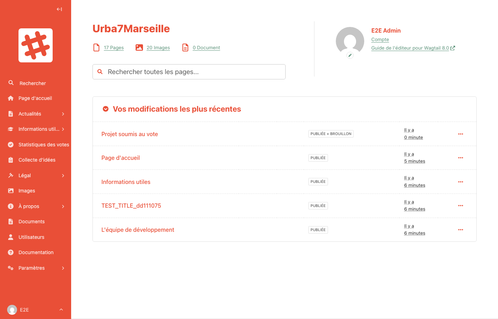

# Tableau de bord

Le tableau de bord est la page qui s'ouvre après la connexion. Il rassemble ce qui demande votre attention et les raccourcis vers les tâches fréquentes.

## Les panneaux

### Actions rapides

Des boutons pour les tâches les plus courantes :

- **Nouveau projet**, **Nouvel événement**, **Nouvelle fiche « Informations utiles »** : ouvrent le [choix d'un modèle](modeles.md) ;
- **Modifier la page d'accueil** ;
- **Modifier l'annonce** : le [bandeau en haut du site](annonce.md).

Seules les actions que vous avez le droit de faire sont affichées.

### Consultations à suivre

Les projets dont le **vote** ou la **collecte d'idées** est ouvert : le type de participation, la date de clôture, le nombre de réponses, et un lien **Voir les réponses** vers les [votes](statistiques-votes.md) ou les [idées](collecte-idees.md).

### Événements à venir

Les prochains événements, avec leur date et le nombre de personnes qui ont cliqué sur « Ça m'intéresse ».

### Brouillons en attente de publication

Les pages avec des modifications **pas encore publiées**, quel qu'en soit l'auteur, de la plus récente à la plus ancienne. Pratique pour ne rien oublier. Le panneau n'apparaît que s'il y a des brouillons.

### Plus bas

Les panneaux habituels de Wagtail : **vos modifications les plus récentes**, et les pages verrouillées ou en attente de validation, s'il y en a.

En haut de la page, les compteurs (pages, images, documents) et la **barre de recherche** permettent de retrouver une page par son titre.

## La barre latérale

Le menu est organisé par tâche :

| Entrée | Contenu |
|---|---|
| **Rechercher** | Rechercher une page dans tout le site |
| **Page d'accueil** | Composer la page d'accueil → [Page d'accueil](page-accueil.md) |
| **Actualités** | Page « Actualités », toutes les publications, **Nouveau projet**, **Nouvel événement** → [Actualités](publications/index.md) |
| **Informations utiles** | Page « Informations utiles », toutes les fiches, **Nouvelle fiche** → [Informations utiles](fiches-pedagogiques.md) |
| **Pages du site** | Les pages « À propos » et les pages légales → [À propos](a-propos.md), [Pages légales](legal.md) |
| **Participation** | **Votes** et **Idées** des habitants → [Votes](statistiques-votes.md), [Idées](collecte-idees.md) |
| **Médiathèque** | **Images** et **Documents** → [Images](images.md), [Documents](documents.md) |
| **Paramètres** | **Annonce**, **Utilisateurs** et les réglages techniques → [Annonce](annonce.md), [Utilisateurs](utilisateurs.md) |
| **Documentation** | Ce guide |

**Chacun ne voit que ce qu'il peut faire.** Un membre d'association ne voit pas la gestion des utilisateurs, et les entrées de contenu (Actualités, Pages du site…) n'apparaissent que si ses groupes lui permettent de modifier ces pages. Voir [Utilisateurs](utilisateurs.md).

> **Astuce :** Vous pouvez réduire la barre latérale en cliquant sur la flèche en haut à gauche pour avoir plus d'espace d'édition.
