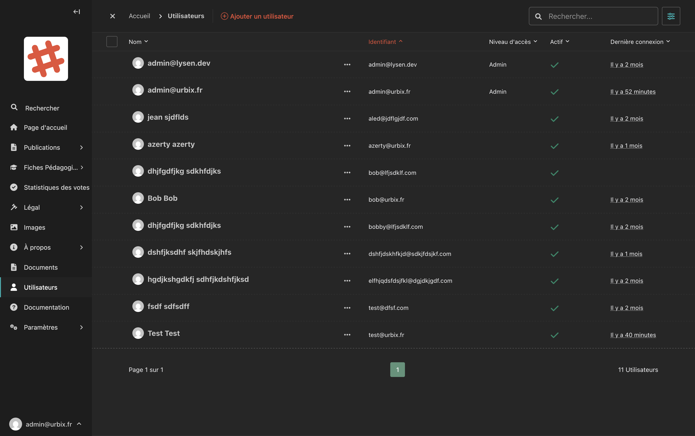

# Gestion des utilisateurs

La section **Utilisateurs** est accessible directement depuis la barre latérale. Elle vous permet de gérer les comptes des personnes ayant accès à la plateforme.

## Accéder à la gestion des utilisateurs

Dans la barre latérale, cliquez sur **Utilisateurs**.

## La liste des utilisateurs

<!-- Capture d'écran : liste des utilisateurs avec les colonnes Nom, Identifiant, Niveau d'accès, Actif, Dernière connexion -->

La liste affiche pour chaque utilisateur :

| Colonne | Description |
|---|---|
| **Nom** | Le nom complet de l'utilisateur |
| **Identifiant** | L'adresse e-mail utilisée pour se connecter |
| **Niveau d'accès** | **Admin** (accès complet) ou sans mention (accès limité) |
| **Actif** | ✓ si le compte est actif |
| **Dernière connexion** | La date de la dernière connexion |

## Ajouter un utilisateur

1. Cliquez sur **"Ajouter un utilisateur"** en haut de la page.
2. Remplissez les informations du nouveau compte.
3. Définissez le niveau d'accès et les groupes.
4. Cliquez sur **"Enregistrer"**.

## Groupes et rôle

Chaque utilisateur peut appartenir à un ou plusieurs **groupes** qui déterminent ses droits dans l'interface d'administration :

| Groupe | Description |
|---|---|
| **Editors** | Peut créer, modifier et publier du contenu |
| **Moderators** | Peut modérer les contributions des citoyens |

> **Rôle automatique :** Lorsqu'un utilisateur est ajouté au groupe **Editors** ou **Moderators**, son rôle est automatiquement défini à **Membre associatif** sur la plateforme. Ce rôle lui donne des droits supplémentaires côté site public (vote, participation aux consultations, etc.). Lorsqu'il est retiré de ces deux groupes, son rôle revient à **Citoyen**.

## Modifier un utilisateur

1. Cliquez sur les **"···"** à côté du nom de l'utilisateur.
2. Sélectionnez **"Modifier"**.
3. Effectuez les modifications souhaitées.
4. Cliquez sur **"Enregistrer"**.

## Désactiver un compte

Pour désactiver temporairement un compte sans le supprimer, modifiez l'utilisateur et **décochez la case "Actif"**. L'utilisateur ne pourra plus se connecter, mais ses contributions sont conservées.

## Niveaux d'accès

| Niveau | Droits |
|---|---|
| **Administrateur** | Accès complet à toutes les fonctionnalités, y compris la gestion des utilisateurs |
| **Éditeur / Modérateur** | Peut créer et publier du contenu selon les permissions de son groupe |

> **Sécurité :** N'accordez le niveau Administrateur qu'aux personnes qui en ont réellement besoin.
