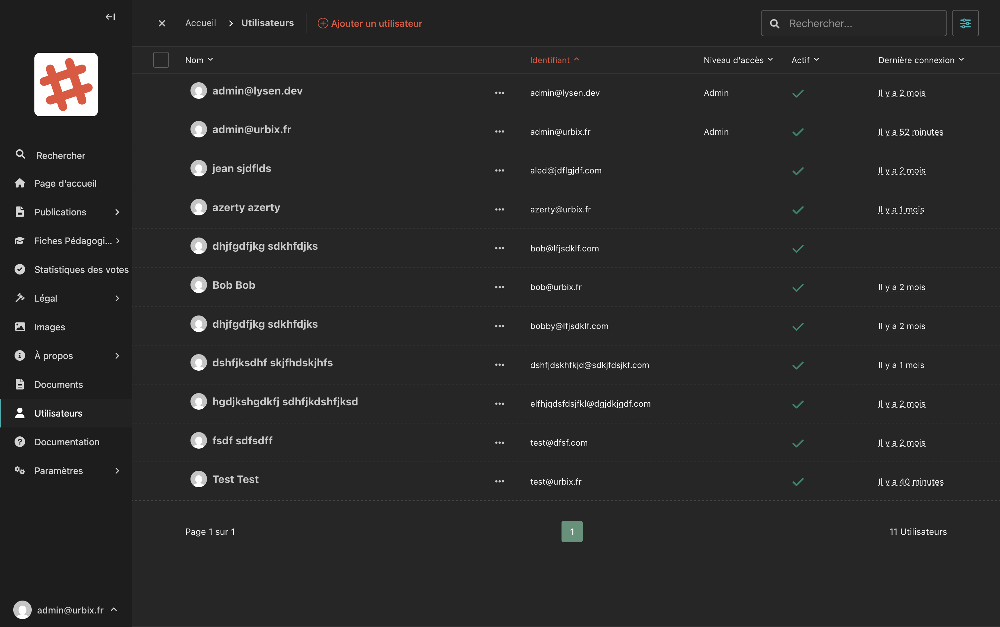

# Gestion des utilisateurs

La gestion des **utilisateurs** permet de gérer les comptes : ceux des habitants comme ceux des membres de l'équipe. Elle est réservée aux **administrateurs**.

## Accéder à la gestion des utilisateurs

Dans la barre latérale, ouvrez **Paramètres** puis cliquez sur **Utilisateurs**.

## La liste des utilisateurs

<!-- Capture d'écran : liste des utilisateurs avec les colonnes Nom, Identifiant, Niveau d'accès, Actif, Dernière connexion -->

La liste affiche pour chaque utilisateur :

| Colonne | Description |
|---|---|
| **Nom** | Le nom complet de l'utilisateur |
| **Identifiant** | L'adresse e-mail utilisée pour se connecter |
| **Niveau d'accès** | **Admin** pour les comptes avec tous les droits techniques |
| **Actif** | ✓ si le compte est actif |
| **Dernière connexion** | La date de la dernière connexion |

## Ajouter un utilisateur

1. Cliquez sur **"Ajouter un utilisateur"** en haut de la page.
2. Remplissez les informations du nouveau compte.
3. Choisissez son **rôle** et, si besoin, ses **groupes**.
4. Cliquez sur **"Enregistrer"**.

## Rôles

Le **rôle** d'un compte détermine son accès à l'administration :

| Rôle | Accès |
|---|---|
| **Citoyen** | Un compte du site : voter, proposer des idées, suivre les projets. Pas d'accès à l'administration |
| **Membre d'association** | Accès à l'administration pour le contenu et la participation, modification de l'[annonce](annonce.md). Ne gère pas les comptes |
| **Administrateur** | Les mêmes droits, plus la gestion des comptes et des rôles |

Le menu de chacun ne montre que ce qu'il peut faire : un membre d'association ne voit pas la gestion des utilisateurs, et les entrées de contenu dépendent de ses groupes.

### Groupes : les droits sur les pages

Les droits de **création et de publication des pages** viennent des **groupes** :

| Groupe | Droits |
|---|---|
| **Editors** | Créer et modifier des pages, sans les publier |
| **Moderators** | Créer, modifier et publier des pages |

Ajoutez à un groupe les membres qui gèrent le contenu.

## Modifier un utilisateur

1. Cliquez sur les **"···"** à côté du nom de l'utilisateur.
2. Sélectionnez **"Modifier"**.
3. Effectuez les modifications souhaitées.
4. Cliquez sur **"Enregistrer"**.

## Désactiver un compte

Pour désactiver un compte sans le supprimer, modifiez l'utilisateur et **décochez la case "Actif"**. La personne ne peut plus se connecter, ses contributions sont conservées.

> **Sécurité :** Ne donnez le rôle Administrateur qu'aux personnes qui en ont réellement besoin.

## Ce que les habitants gèrent eux-mêmes

Depuis leur profil sur le site, les habitants peuvent, sans votre intervention :

- **recevoir à nouveau le lien de confirmation** de leur adresse email (nécessaire pour voter ou proposer une idée) ;
- choisir leurs **notifications par email**, toutes désactivées par défaut : *Résultats des votes*, *Actualités des projets*, *Rappels d'événements*. Chaque email contient un lien de désinscription ;
- s'abonner ou se désabonner de la **newsletter** ;
- **Télécharger mes données** : un fichier avec tout ce que le site conserve sur eux (droit d'accès RGPD) ;
- **Supprimer mon compte**.
